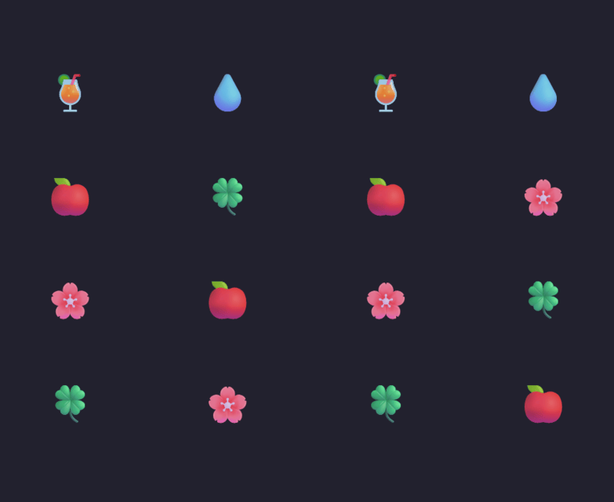
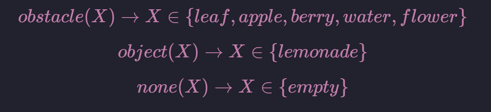
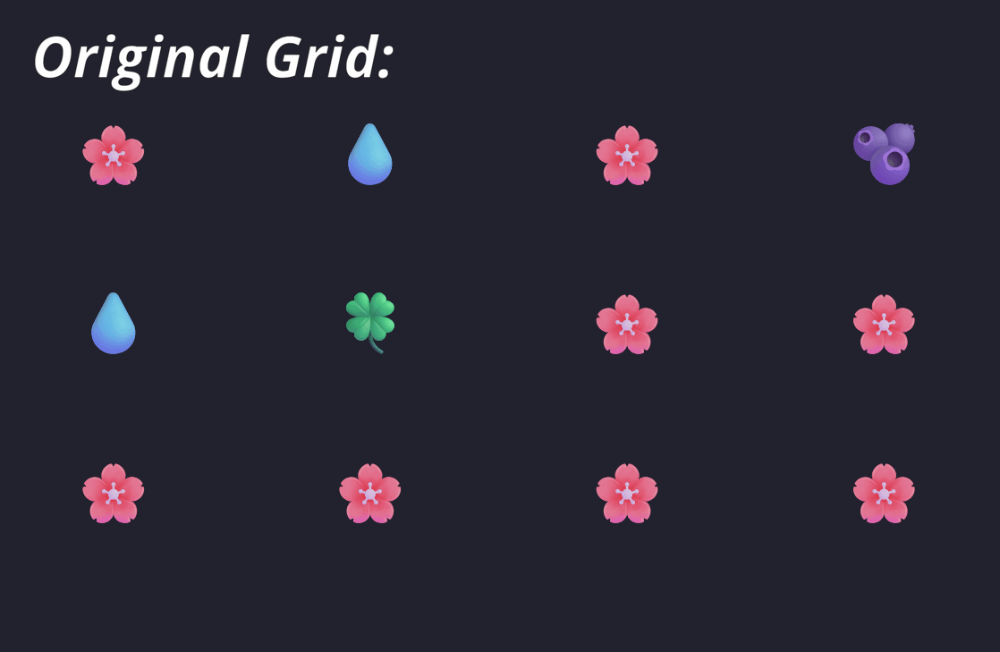
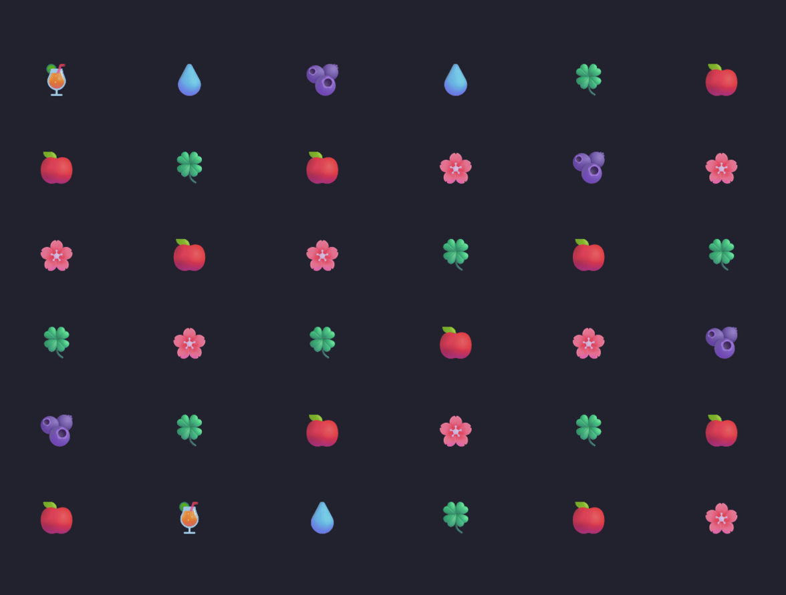

## Intro to Logic-Based AI Final Project (Fall 2025)
**Milena (Mila) Zlatkovic**



## Overview:

For this project, my goal was to begin to formalize an approach to the pattern-matching game, *Gardenscapes.* To do this, I approached the problem through programming in Prolog; the fundamental piece of this approach being the interaction between a set of rules (horn clauses) and queries accross these.

## Defining States and Goal

In this project I defined the grid as being made up of cells. Each cell has a type and a position.

``` Prolog
% defining a cell holding type object at Pos(0,0)
cell(object(lemonade), pos(0,0)).
```
Types represent obstacles (these are the pieces that can be matched), objects (represent the piece that should reach the ground in the goal condition), or none. These are defined formally as follows:



The initial state of a grid must de defined (see example below) in a prolog file and be loaded for [*solver.pl*](../src/solver.pl) before execution. 

In addition to a list of cells *(types and positions)*, this file sets definitions on dimensions, number of goal objects, and positions by rows and columns for easier traversal.

```Prolog
width(4).
height(4).
total_objects(2).

% list of cell definitions for a given state
state44([
    cell(object(lemonade), pos(0,0)),
    cell(obstacle(water), pos(0,1)),
    cell(object(lemonade), pos(0,2)),
    cell(obstacle(water), pos(0,3)),

    cell(obstacle(apple), pos(1,0)),
    cell(obstacle(leaf), pos(1,1)),
    cell(obstacle(apple), pos(1,2)),
    cell(obstacle(flower), pos(1,3)),

    cell(obstacle(flower), pos(2,0)),
    cell(obstacle(apple), pos(2,1)),
    cell(obstacle(flower), pos(2,2)),
    cell(obstacle(leaf), pos(2,3)),

    cell(obstacle(leaf), pos(3,0)),
    cell(obstacle(flower), pos(3,1)),
    cell(obstacle(leaf), pos(3,2)),
    cell(obstacle(apple), pos(3,3))
]).

% list of row positions
rows([
    [pos(0,0), pos(0,1), pos(0,2), pos(0,3)],
    [pos(1,0), pos(1,1), pos(1,2), pos(1,3)],
    [pos(2,0), pos(2,1), pos(2,2), pos(2,3)],
    [pos(3,0), pos(3,1), pos(3,2), pos(3,3)]
]).

% list of column positions
cols([
    [pos(0,0), pos(1,0), pos(2,0), pos(3,0)],
    [pos(0,1), pos(1,1), pos(2,1), pos(3,1)],
    [pos(0,2), pos(1,2), pos(2,2), pos(3,2)],
    [pos(0,3), pos(1,3), pos(2,3), pos(3,3)]
]).
```

## Mechanics of This Approach

At its core, this solver operates by attempting to resolve a proposed move by *querying* over a defined set of rules. A move is deemed valid if there is a path through the clauses that evaluates to true. Another core element of the solver is the inherent *backtracking* done in prolog. This is important in this application because I am only interested in valid swaps can succesively lead to my goal condition. 

The current algorithm runs as follows:
- Given a current state for the grid, identify cells that are swappable.
  - To be swappable, types must be compatible, adjacent, and must generate a match.
- A valid swap is then applied (tracked in a copy of the state) and the grid processes the change by removing all matches and applying the *gravity* functionality to move pieces from above down.
  


- The grid is then checked for the goal condition.
  - If the goal is met, the program is able to export a list of the intermediate states that led to the result.
  - If the goal is not met and there are further swaps to be applied, it continues.
  - If the goal is not met and no more swaps can be applied it **backtracks** and attempts to find a different plan to reach the goal.
- In the case where there is no solution the program will return false.


## Demo

The following animation is put together from the output of intermediate states found by the solver. They have been exported to a json file and interpreted visually by python scripts in [the display directory](../display/).



**Process to Obtain the Result Above:**

[Sample Program Run](walkthrough.mp4)

## Running The Program


## Further Steps

I hope to extend my work on this project further, particularly in the approach to picking the next move to attempt. Currently, the algorithm takes a naive approach and must rely heavily on backtracking (becomes more difficult on larger grids!). I plan to improve this by finding different routes for the solver to take in' more information about the grid arrangement. I would also like to introduce additional features to the program including:
- New piece generation 
- Power-ups (similar to those implemented in the original game)

## References

- Ivan Bratko. *Prolog Programming for Artificial Intelligence-- Fourth Edition*. Pearson, 2012.
- Gardenscapes Game: https://play.google.com/store/apps/details?id=com.playrix.gardenscapes
- GIF Creation Tool: https://ezgif.com/